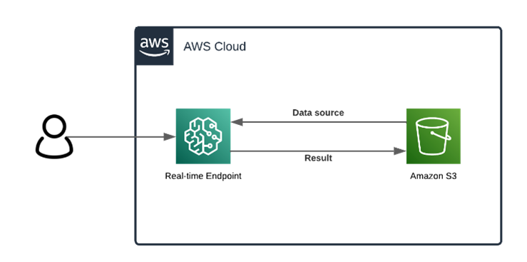
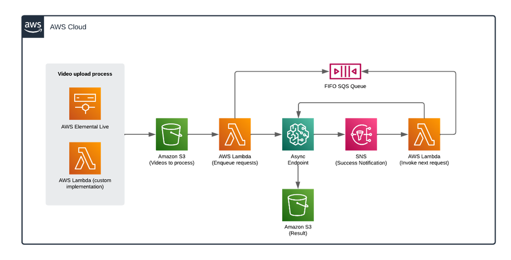

# CxVision - AWS Marketplace Model Package

This repository offers a computer vision solution for tracking people and generate metrics that can be subsequently analyzed to improve the user experience.

This solution allows you to:

* Detect people in videos.
* Count people within a defined zone.
* Measure the spent time in each zone.
* Apply blurring on each person to maintain the privacy.

## Contents

1. [What does the solution do?](#What-does-the-solution-do?)
2. [How does the solution work?](#How-does-the-solution-work?)
    - [Processing independent videos](#1.-Processing-independent-videos)
    - [Processing stream videos](#2.-Processing-stream-videos)
        - [Continuous video upload to Amazon S3 Bucket](#Continuous-video-upload-to-Amazon-S3)
        
## What does the solution do?

The solution allows you to define two zones in each video, a waiting zone (Dwell) and a service zone. This allows you to measure how long a person takes in queue (waiting zone) and how long it takes while being served (service zone). 

> It's not necessary to define the zones. In this case, the solution will measure the time of all the people in the video.

## How does the solution work?

You can deploy the CxVision Model Package from AWS Marketplace and then configure some services needed to run the solution.
The solution could be consumed in two different ways:

### 1. Processing independent videos 
This deployment mode allows processing independent videos synchronously. The videos to be processed must be stored in Amazon S3. In the following diagram you can see the flow of this process:

To make real-time inferences, please follow the instructions in this notebook: [Processing Independent Videos Notebook](./IndependentVideos.ipynb)

> At the time of the inference, it is necessary to have all the videos that will be processed because they need to be specified in the inference payload.

### 2. Processing stream videos
The objective of this mode is to process a sequence of related videos. This provides the ability of processing videos in near real-time by uploading sequential and constant video fragments to an Amazon S3 Bucket and executing a trigger for each new video fragment. The following diagram shows the flow of this process:

> Unlike the first scenario, you don't need to have all the videos to start the execution of the solution. When a video is uploaded to the bucket, it is processed by the solution.

#### Continuous video upload to Amazon S3:
This alternative assume you are uploading constant videos fragments to an Amazon S3 Bucket. You could use any tool to achieve this, such as:

* **Amazon Elemental Media Live**: This AWS service allows you to create a streaming video broadcast channel and broadcast the output to different sources, one of these can be an Amazon S3 Bucket. This service can be configured to sequentially broadcast video fragments of a certain length in seconds.
* **Own implementation:** Another alternative is just cut the videos manually and then upload them to S3 Bucket. For this solution we developed a lambda function that receives a video as input, which is divided into fragments with a given duration in seconds and then loaded to a new path of the Amazon S3 Bucket.

To process stream videos, please follow the instructions in this notebook:  [Processing stream videos Notebook](./StreamVideos.ipynb)
